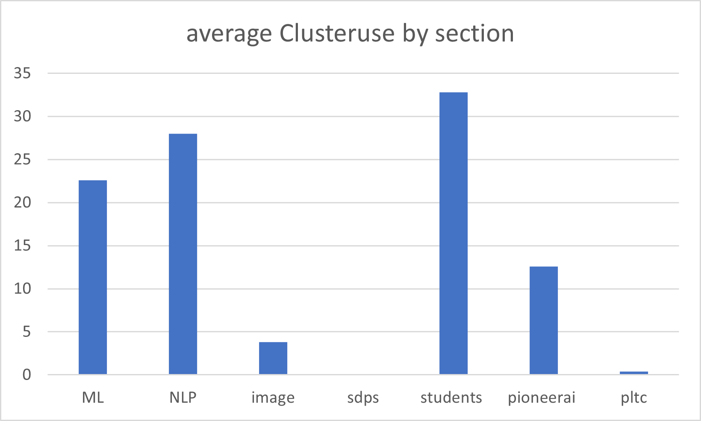

# Slurm cluster

All Information on the page are subject to change!

Table of Contents
=================

* [Getting access](#getting-access)
  * [External guests](#external-guests)
* [Support](#support)
* [Basic Access and First Time Setup](#basic-access-and-first-time-setup)
* [General Information](#general-information)
  * [Limits](#limits)
  * [Available GPUs](#available-gpus)
  * [Software Modules](#software-modules)
  * [ERDA](#erda)
  * [SIF](#sif)
  * [Files](#files)
  * [ssh tunnelling and port forwarding](#ssh-tunnelling-and-port-forwarding)
* [Using Slurm](#using-slurm)
  * [Examples for BatchScripts](#examples-for-batchscripts)
    * [Minimal Example](#minimal-example)
    * [Start a Job using GPU resources](#start-a-job-using-gpu-resources)
  * [Scheduling many tasks](#scheduling-many-tasks)
  * [Determining memory requirements](#determining-memory-requirements)
* [Behind the Scenes](#behind-the-scenes)
  * [Scheduling](#scheduling)
  * [Cluster Usage](#cluster-usage)
* [Frequently asked questions](#frequently-asked-questions)

## Getting access
1. Request "SRV-hendrixgate-users" through identity.ku.dk
2.  * Employees should send a mail to cluster-access@di.ku.dk
    * Students should have their supervisor send a mail to cluster-access@di.ku.dk, or cc their supervisor for confirmation that they need cluster access.
    * whether you are a student or an employee, you should include your ku-id in the mail as well as your research section affiliation (students should write student). this drastically reduced the time it will take to get access.

### External guests
Access to the cluster infrastructure requires an active account. Access for external guests can be requested by a KU employee via https://identity.ku.dk/ -> "Menu button" -> "Manage Identity" -> "Create external guest". Make sure that the checkbox next to "Science guest" is ticked. The guest user must then follow the instructions outlined in the e-mail they receive. Afterwards they can request the required role via "https://identity-guest.ku.dk/identityiq/login.jsf" -> Login -> "Manage My Access" -> Search -> Select check button next to "SRV-hendrixgate-users" -> Next -> Submit. Afterwards the KU employee should send an e-mail to cluster-access@di.ku.dk including the external guest's e-mail address as well as their name or user id. Once the external guest receives our welcome e-mail they should follow the steps below.

## Support
All support requests should be by mail to cluster-support@di.ku.dk

## Basic Access and First Time Setup
The server is accessed via a two-layer access: first you connect to the university network,
and then you use ssh to connect to the server. To connect to the university network, either use a direct network cable
connection in your office or use VPN. VPN comes pre-installed on KU-Computer and for MacOSX and Windows there are guides
online on [kunet](https://kunet.ku.dk/employee-guide/Pages/IT/Remote-access.aspx). For Linux, please download the fitting
[AnyConnect Secure Mobility Client v4.x](https://software.cisco.com/download/home/283000185).

For the second step, you need to install and configure ssh. Put the following in your `~/.ssh/config` (Linux/MacOS) or
in `C:/Users/YOUR_WINDOWS_USER/.ssh/config` (Windows, a simple text file with no file ending!):

    Host hendrix
        HostName hendrixgate
        User <kuid>
        StrictHostKeyChecking no
        CheckHostIP no
        UserKnownHostsFile=/dev/null

Windows users should be aware that sometimes it wont work unless you have the qualified domain name I.E. you should write :

    Hostname hendrixgate.unicph.domain

With this in place, you can open a terminal (cmd or PowerShell in Windows) and run

    ssh hendrix

This will connect you to a (random) gateway server. Gateway servers are small, relatively weak virtual machines and each time you login, you can be connected to a different server. As a normal use, you are not able to connect to the compute servers directly. Gateway servers allow you to compile programs or run small evaluation scripts, but anything that requires real compute power must be run on the compute servers via slurm. We have had issues with people running VSCode on the gateservers. They are not dimensioned to be able to cope with the sloppy memory demands of VScode and we strongly discourage this. We are working on getting a larger gateserver specifically dimensioned to run more demanding stuff, but this is not yet a reality.

## General Information

### Limits

There are a few limits, decided by the cluster usergroup and enforced by the system which it may be helpfull to be aware of

1. there is a limit of 8 gpus per user, which means that any jobs exceeding this limit will be rejected at queue time
2. the default timelimit for a job is 5 hours, which means that any job that does not have an explicit timelimit will terminate after 5 hours regardless if the job has finished.
3. there is a max timelimit for a job of 48 hours. this means that all jobs will terminate after 48 hours regardless if the job has finished.

### Available GPUs

The cluster currently hosts one main partition with the following GPU cards:

| Resource-Name   | Model                       | Count | Memory(GB) |
|-----------------|-----------------------------|-------|----------- |
| H100            | Nvidia H100                 |     4 | 80         |
| A100            | Nvidia A100                 |    26 | 80/40      |
| A40             | Nvidia A40                  |    14 | 40         |
| titanrtx        | Titan RTX + Quadro RTX 6000 |    55 | ??         |
| titanx          | Titan X/Xp/V                |    15 | ??         |

### Software Modules
On RHEL servers, many default packages are quite old. To get access to newer versions, as well as additional software packages, the cluster use
the module package. A package can be loaded via the command

    module load software/version
    #for example for python 3.9.9:
    module load python/3.9.9
    python3 --version
    # prints 3.9.9

The list of all available software modules can be seen via

    module avail

The current list of modules includes modern compilers, python versions, anaconda, but also cuda and cudnn.
Modules need to be loaded every time you login to a server, therefore it makes sense to store the commands in your `~/.bashrc`

### ERDA
Go to [https://erda.dk](https://erda.dk) for access to ERDA.

You can use sshfs to mount an ERDA directory. Once you have access to ERDA, create a new public/private key pair. Go to [Setup > SFTP](https://erda.dk/wsgi-bin/setup.py?topic=sftp) to add the public key to ERDA and put the private key in `~/.ssh` in your home dir on the cluster. On this page you also find the login details and your erda username, which can be different from your kuid and which you need for the scripts below.

Note that you need to mount ERDA directories on the machines that the job is submitted to. A simple approach is to make scripts that mounts/unmounts the ERDA directory and call it in the slurm batch script.

`mount_erda.sh`

    #!/bin/bash
    key=<path-to-ssh-key>
    user=<erda-username>
    erdadir=<erda-dir-to-mount>
    mnt=<mount-location>
    if [ -f "$key" ]
    then
        mkdir -p ${mnt}
        sshfs ${user}@io.erda.dk:${erdadir} ${mnt} -o reconnect,ServerAliveInterval=15,ServerAliveCountMax=3 -o IdentityFile=${key}
    else
        echo "'${key}' is not an ssh key"
    fi

`unmount_erda.sh`

    #!/bin/bash
    fusermount -u <mount-point>

`your-slurm-script.sh`

    #!/bin/bash
    # ...
    # ... Slurm parameters
    # ...
    ./mount_erda.sh
    <path-to-your-script>
    ./unmount_erda.sh

### SIF
[https://diku-dk.github.io/wiki/slurm-sif](https://diku-dk.github.io/wiki/slurm-sif)

### Files
Once you are in the university network (cable or VPN, see [Getting Access](#getting-access)), you can copy single files or directories using scp (safe copy):

    scp -r my_file1 my_file2 my_folder/ hendrix:~/Dir

Or, you can use any sftp client. It is also possible to mount your hendrix home directory on your local machine for easy copying and editing of files.

Unix users can simply use sshfs (note that the full path to your home dir is important! '~' or '$HOME' will not work!)

    sshfs xyz123@hendrix:/home/xyz123/ <target_directory>

On Windows however you will have to download and install [WinFsp and SSHFS-Win](https://github.com/winfsp/sshfs-win)  Then in your Windows file manager open the Map network drive wizard and enter

    \\sshfs\xyz123@hendrixgate.unicph.domain

in the Folder field and click Finish. It will prompt you for your password. Note that here you do not need to specify your home dir path, but adding '.unicph.domain' is important!

### ssh-tunnelling-and-port-forwarding
(Todo: this is not updated for hendrix. likely some of the details won't work)

You can use ssh tunnelling / port forwarding to expose network services on remote servers directly on the local system.

For example,

    ssh -L 15000:cluster:22 gate-diku -N

establishes a tunnel forwarding connections to the local port 15000 (WARNING: in practice, use a unique, unoccupied port above 1023) to cluster:22 via gate-diku (as configued in the ssh client configuration recommended above). This allows copying files using scp from your local machine using

    scp -P 15000 file_to_copy localhost:directory_on_cluster_head/

If used in connection with key-based authentication, your KU password needs only to be entered once, namely when establishing the tunnel.

Port forwarding can simplify access to non-public svn/git repositories. For svn, this can be done by adding a new protocol to your svn configuration in ~/.subversion/config :

    [tunnels]
    ### 'svn+sshtunnel':
    sshtunnel = ssh -qp 15573

Again, remember to change the port number. After opening the ssh tunnel on this port with

    ssh -L 15573:repo_server:22 gate-diku -N

you can checkout the remote repository on repo_server using

    svn checkout svn+sshtunnel://localhost/svn/MyRepos/trunk .

Once you are done, you can close the tunnel using Ctrl-C.

This can also be used to run interactive jupyter notebooks.
See [Jupyter Notebooks](slurm-jupyter.md)

## Using Slurm
Slurm is a Batch processing manager which allows you to submit tasks and request a specific amount of resources which have to be reserved for the job. Resources are for example Memory, number of processing cores, GPUs or even a number of machines. Moreover, Slurm allows you to start arrays of jobs easily, for example to Benchmark an algorithm with different parameter settings. When a job is submitted, it is enqueued to the waiting queue and will stay there until the required resources are available. Slurm is therefore perfectly suited for executing long-running tasks.

To see how many jobs are queued type

    squeue

To submit a job use

    sbatch sbatchScript.sh

Where the sbatchscript.sh file is a normal bash or sh script that also contains information about
the ressources to allocate. Jobs are run on the node in the same path as the path you were when you submitted the job.
This means that storing files relative to your current path will work flawlessly.

### Examples for BatchScripts

#### Minimal Example
A quite minimal script looks like:

    #!/bin/bash
    #The partition is the queue you want to run on. standard is gpu and can be ommitted.
    #SBATCH -p gpu
    #SBATCH --job-name=MyJob
    #number of independent tasks we are going to start in this script
    #SBATCH --ntasks=1
    #number of cpus we want to allocate for each program
    #SBATCH --cpus-per-task=4
    #We expect that our program should not run longer than 2 days
    #Note that a program will be killed once it exceeds this time!
    #SBATCH --time=2-00:00:00
    #Skipping many options! see man sbatch
    # From here on, we can start our program

    ./my_program option1 option2 option3
    ./some_post_processing

#### Start a Job using GPU resources
Asking for gpu resources requires indicating which and how many gpus you need. the format is either --gres=gpu:number, e.g. --gres=gpu:2 or a specific gpu type like
--gres=gpu:titanx:2. The types of GPUs supported and their amount of memory available are given [in this table](#available-gpus). An example script could look like

    #!/bin/bash
    # normal cpu stuff: allocate cpus, memory
    #SBATCH --ntasks=1 --cpus-per-task=10 --mem=6000M
    # we run on the gpu partition and we allocate 2 titanx gpus
    #SBATCH -p gpu --gres=gpu:titanx:2
    #We expect that our program should not run longer than 4 hours
    #Note that a program will be killed once it exceeds this time!
    #SBATCH --time=4:00:00

    #your script, in this case: write the hostname and the ids of the chosen gpus.
    hostname
    echo $CUDA_VISIBLE_DEVICES
    python3 yourScript.py

### Scheduling many tasks
Please take a look at [job arrays](https://slurm.schedmd.com/job_array.html) when scheduling many similar tasks. Job arrays are preferred to multiple jobs when you have a lot of tasks with the same requirements. They are easier on the scheduler, which does not need to attempt to schedule all tasks at the same time, but only a small subset.  You can also use job arrays to limit the number of jobs run at the same time.  This allows other users to use our cluster without having to wait.

Implementing a job array is easy, as slurm provides an environment variable `${SLURM_ARRAY_TASK_ID}` that indicates the id of the job that is run. This can be supplied as additional program argument, for example to index an array of hyper parameters in your scripts.
In the script the number of cores is restricted to 4 for each task in the array, so the total script uses 28 cpus

    #!/bin/bash
    #SBATCH --job-name=ArrayMatlab
    # we start 7 tasks numbered 1-7 but only 3 can run in parallel
    #SBATCH --array 1-7%3
    #number of cpus we want to allocate for each task
    #SBATCH --cpus-per-task=4
    # max run time is 24 hours
    #SBATCH --time= 24:00:00

    python experiment.py ${SLURM_ARRAY_TASK_ID}

### Determining memory requirements
Before running multiple jobs with high memory requirements consider running just one to see how much memory you need. Useful commands are /usr/bin/time (run like /usr/bin/time -v python my_script.py --my_param 42)
it outputs multiple lines, including one which looks like this:

    Maximum resident set size (kbytes): 1892412

This suggests that you don't need more than 2 GB of memory for this job.  Alternatively you can check the accounting database once your job has terminated, which might be less reliable:

    [fwc817@a00552 ~]$ sacct -j <past_job_id> -o JobName,MaxRss,State,AllocCPUs
       JobName     MaxRSS      State  AllocCPUS
    ---------- ---------- ---------- ----------
    job_name_+             COMPLETED          2
         batch  18462780K  COMPLETED          2

This job shouldn't need more than 20 GB of RAM. Remember to add a suitable amount of RAM for shared memory (column SHR when using top). Using multiple processes makes this process even less straightforward and moves into the reign of educated guesswork.

Keeping these estimates low albeit realistic increases the utilisation of our hardware, which hopefully translates into lower waiting times.

## Behind the Scenes
Have you ever wondered why your job is not getting GPU time? a lot of stuff is going on behind the scenes and not everything is visible to all users. this section tries to give you some insights to help you understand how the cluster works.
### Scheduling
After submitting a job (via sbatch or srun) it enters the scheduling queue. If there are no other jobs waiting it will reside there until enough resources (i.e. a node which satisfies the requested resources, including GPUs, CPU core count, and memory) are available. Until then it will show up in the scheduling queue like this:

    [fwc817@a00552 ~]$ squeue
                 JOBID PARTITION     NAME     USER ST       TIME  NODES NODELIST(REASON)
               1894291       gpu     bash   fwc817 PD       0:00      1 (Resources)

If there are enough other jobs waiting, job starting times are ordered by [priority scheduling](https://diku-dk.github.io/wiki/slurm-scheduling) that ensures that all users have access to a similar share of the resources.

Sometimes a job will not start for seemingly unknown reasons: a node might appear free, but the job is still held in queue, even though it might fit. The most likely reason is that the job is not actually free, but used by a job on a partition that is invisible to you (e.g., special priority queues for users who own a server). Another frequent reason is that a job might be able to start but not end without delaying a job with higher priority.

### Cluster Usage
There are numerous ways to visualise the usage of the cluster. Most of them are available to all users and can be accessed using the sacct sacctmgr and scontrol slurm commands. to get a quick overview of the usage of the cluster it might be a bit much though so the following are a few visualisation of the usage of the cluster. theey will be updated on a quarterly basis so dont expect thsi to be super updated:
the cluster is shared between the different research sections and the following is a visualisation of the percentagevize usage between the sections from january 2024 to july 2024 :

Students has been included as a separate column since the cluster is also a teaching resource and many thesis students participate in research projects.

## Frequently asked questions
This section will be a collection of frequently asked questions. Please refer to these before asking questions directly to the cluster-support mail. your question might already have been answered

#### Q:  
I get " connection closed by 10.84.3.168 port 22" (or some similar IP)?

#### A:
Sometimes people loose access to the cluster because they chance their affiliation or renew their contract. Unfortunately we, the admin team, don't get any notification when this happens and therefore we rely on your input as users. there are two things you can do to make this go smoother. If you know there is such a change coming up for you, notify us as soon as the change is effective so we can readd you as fast as possible. otherwise as soon as you notice this send a mail to cluster support with the error message

#### Q:
Why do the nodes go down?

#### A:
the cluster runs 24/7 and the nodes, like any computer used for development, sometimes experience software or hardware failures. we check the nodes almost every day, and get them up and running again as fast as possible. Sometimes we have to wait for help from KU-IT (usually in the case of hardware failures) and sometimes we have to wait for running jobs to exit before we can reboot a node.

#### Q:
Why are nodes Draining for so long?

#### A:

When a node is Draining (I.E. it does not accept new jobs) it is usually (9 of 10 cases) because a previous job have exited badly. this can happen for many reasons such as bugs in the scripts run, that cause memory leaks or just bad luck. when this happens there may still be other jobs running on the node, and while the zombie-job might cause a drain the other jobs on the node is allowed to terminate before the node can be rebooted. Our policy is that we always allow healthy jobs to terminate on  draining nodes if possible. This may result in nodes draining for hours or even days, but the alternative is that users would se their healthy jobs terminated for no obvious reason.
